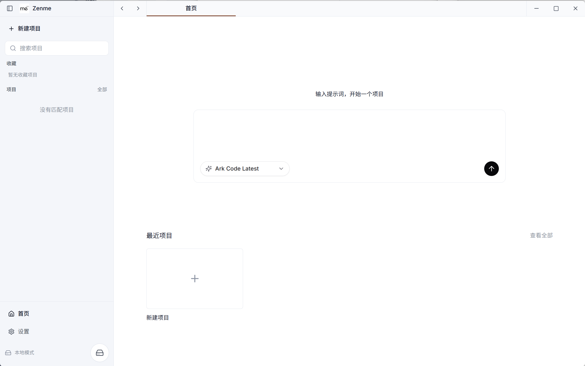
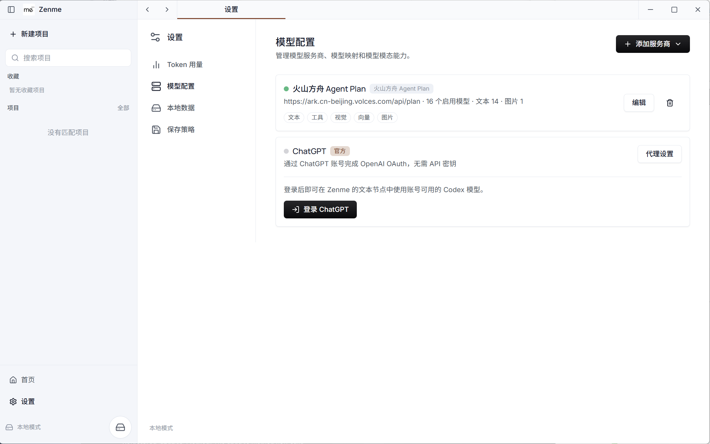
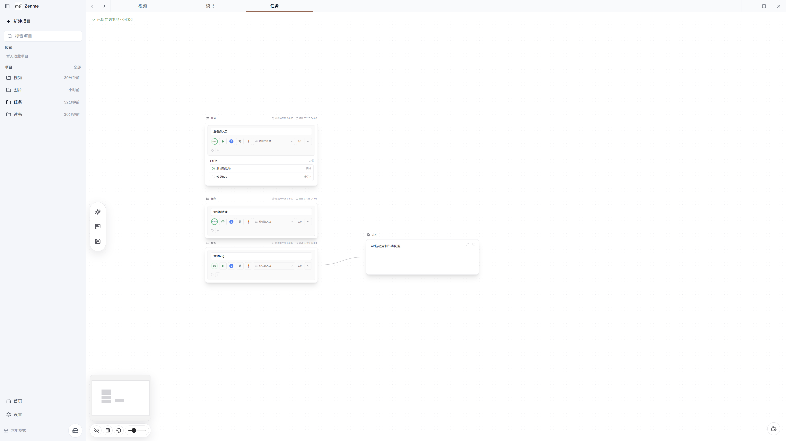
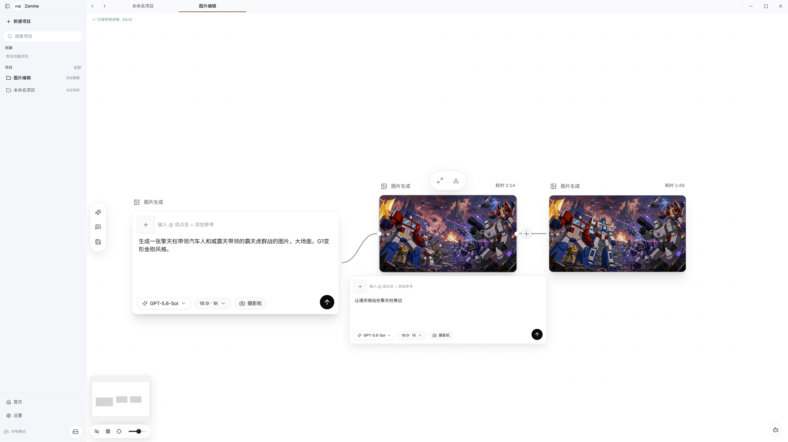
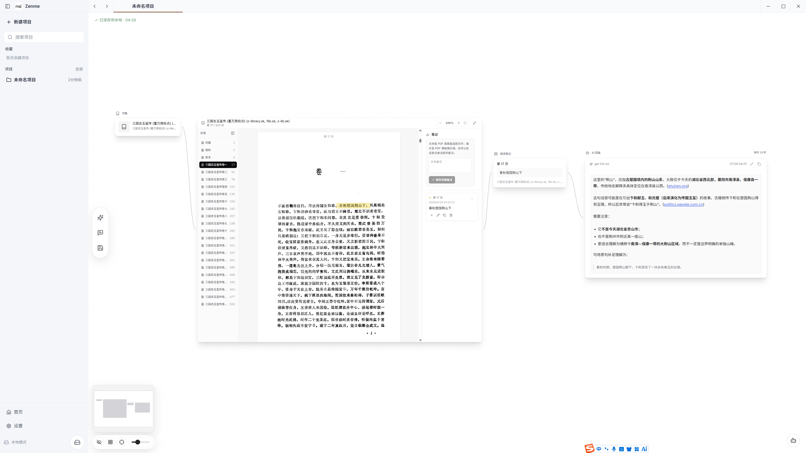

<p align="center">
  
</p>

<h1 align="center">Zenme</h1>

<p align="center">
  本地优先的 AI 无限画布桌面应用。把思考、生成、阅读与任务管理连接在同一个空间。
</p>

<p align="center">
  <a href="https://github.com/alkaiddiamond/zenme-local/releases">下载</a> ·
  <a href="docs/README.md">工程文档</a> ·
  <a href="CONTRIBUTING.md">参与贡献</a> ·
  <a href="LICENSE">MIT License</a>
</p>

> 当前版本：`v0.1.0 Alpha`。Windows x64 是当前公开发布目标；数据格式、升级流程和部分交互仍可能调整。



## 为什么是 Zenme

传统 AI 对话会把上下文压缩进一条不断增长的消息流。Zenme 使用无限画布保存思考过程：提示词、AI 回复、图片、视频、任务、书籍和阅读笔记都可以成为节点，并通过连线保留它们之间的关系。

Zenme 是桌面应用，也是一个纯本地工作空间：项目、画布、文件、阅读资料、笔记和设置默认保存在本机，不依赖 Zenme 账号、远程数据库或自动云同步。

## 产品能力

### 灵活接入模型

通过 ChatGPT OAuth 使用账号可用的 Codex 模型，也可以配置兼容 OpenAI 或 Anthropic 协议的服务商。模型按文本、视觉、图片、视频、向量、音频、工具等能力管理，节点只展示真正可用的模型。



### 在画布上组织任务

任务节点支持父子任务、进度、状态、优先级、复杂度、负责人和标签。文本、任务及生成结果可以自由连线、分组、复制和排列，画布自动保存到本地。



### 生成并继续编辑图片

图片生成节点支持提示词、参考图片、画幅和模型选择。生成结果可以继续作为下一次编辑的输入，在画布上保留每一步结果与来源。



### 边读边记，并把笔记交给 AI

在画布中打开 PDF、EPUB 和 TXT，保存阅读进度、目录导航、标注与页内笔记。阅读笔记可以拖回画布，继续连接文本或 AI 回复节点进行分析和创作。



### 更多节点与交互

- 文本、Markdown、代码与 AI 回复节点。
- 图片生成、图片编辑与异步视频生成节点。
- 任务、分组、阅读器、书籍和阅读笔记节点。
- 音乐、音乐播放器与歌词节点。
- 连线、框选、多选、Alt 拖动复制、撤销重做、缩放和小地图。
- 本地 Token 用量统计、数据目录切换、备份与恢复。

## 下载与平台支持

构建产物通过 [GitHub Releases](https://github.com/alkaiddiamond/zenme-local/releases) 发布。Alpha 阶段请先阅读 Release 中的已知问题和安装说明。

| 平台 | 当前状态 | 目标产物 |
| --- | --- | --- |
| Windows 10/11 x64 | 当前发布目标 | NSIS `.exe` |
| macOS 12+ Intel x64 | 发布暂停，保留构建配置 | `.dmg`、`.zip` |
| macOS Apple Silicon | 尚未进入发布范围 | — |
| Linux | 尚未进入发布范围 | — |

未签名的内部 Windows 构建可能触发 SmartScreen。只有经过签名、安装、升级、卸载和冷启动验证的产物才应作为正式 Release 发布。

## 本地数据与隐私

- Zenme 不提供产品账号、云端数据库或自动云同步。
- 模型 API Key、ChatGPT OAuth 凭据和用户内容只保存在本地数据目录。
- 本地 Next.js 服务只监听 loopback，并限制为同源访问。
- 导出的备份默认排除 API Key 和 OAuth 凭据，恢复后需要重新登录或填写密钥。
- 升级和卸载不会主动删除用户数据；删除数据需要用户明确操作。
- 调用外部模型时，发送给对应服务商的内容仍受该服务商的隐私政策约束。

默认数据目录位于 Electron `userData` 下，也可以在设置中选择其他位置。开发环境可通过 `ZENME_DATA_DIR` 指定测试目录，避免使用真实数据：

```powershell
$env:ZENME_DATA_DIR="G:\data\zenme-development"
npm run desktop:dev
```

## 从源码运行

需要 Node.js `22.12–24` 和 npm `11`。

```powershell
git clone https://github.com/alkaiddiamond/zenme-local.git
cd zenme-local
npm ci
npm run desktop:dev
```

Electron 窗口是正式产品入口。单独运行 `npm run dev` 主要用于 Web 界面调试，不能替代桌面端验证。

### 质量检查

```powershell
npm run check          # Lint + 测试
npm run verify         # check + 生产构建
npm run release:check  # 发布门禁 + 桌面打包与冒烟测试
```

### Windows 构建

```powershell
npm run build
npm run desktop:pack      # 生成免安装目录包
npm run desktop:dist:win  # 生成 Windows x64 NSIS 安装包
```

产物输出到 `dist-desktop/`。详细签名、安装验证和回滚流程见 [发布手册](docs/release.md)。

## 项目结构

```text
app/                  Next.js 页面与仅本机访问的 API
components/zenme/     桌面界面、画布、节点和阅读工作区
components/ui/        通用 UI 原语
desktop/              Electron 主进程、IPC、窗口与打包工具
lib/                  AI、本地数据、迁移和领域逻辑
public/               品牌、字体、PDF.js 与静态资源
docs/                 与源码版本绑定的工程文档和 README 图片
```

产品需求、设计资料、路线图和研究文档维护在独立的 `zenme-doc` 仓库；本仓库只保留与代码版本直接绑定的工程资料。

## 文档与贡献

- [工程文档索引](docs/README.md)
- [系统架构](docs/architecture.md)
- [本地数据与迁移](docs/data-and-migrations.md)
- [安全模型](docs/security-model.md)
- [发布手册](docs/release.md)
- [贡献指南](CONTRIBUTING.md)
- [安全策略](SECURITY.md)
- [版本记录](CHANGELOG.md)
- [第三方许可证](THIRD_PARTY_LICENSES.md)

提交 Issue 或日志时，请勿包含 API Key、OAuth 凭据、本地业务文件或完整数据目录。

Zenme 自有代码以 [MIT License](LICENSE) 开源；随应用分发的第三方软件继续适用各自的许可证与署名要求。
