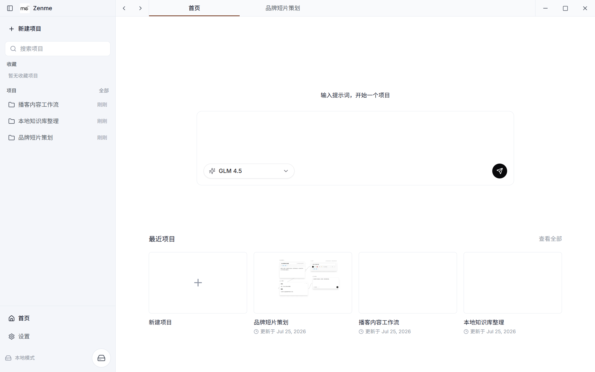
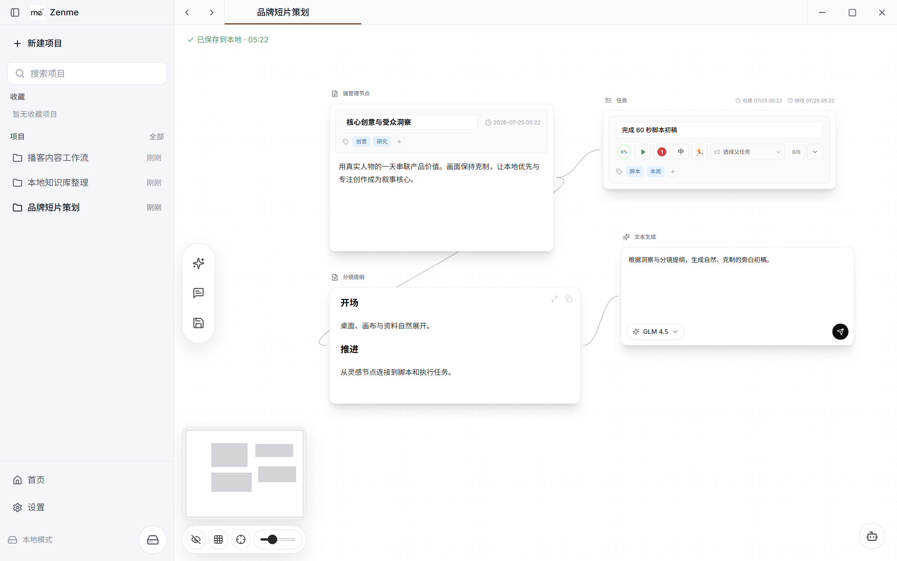

<p align="center">
  
</p>

# Zenme Local

Zenme Local 是一款纯本地的 AI 无限画布桌面应用，用一个可连接、可阅读、可生成的空间组织项目、资料和创作过程。Electron 是正式产品入口，Next.js 服务只监听本机 loopback；项目、画布、文件、阅读资料、笔记和设置均保存在用户选择的本地目录。

> 当前状态：`v0.1.0 Alpha`。适合预览和内部测试，尚未承诺稳定的数据格式或自动升级兼容性。

## 产品预览

| Windows 桌面主页 | Windows 桌面画布与节点 |
| --- | --- |
|  |  |

## 下载与安装

安装包发布在 [GitHub Releases](https://github.com/alkaiddiamond/zenme-local/releases)。首个公开安装包发布前，可按照下方开发说明从源码运行。

| 平台 | 支持状态 | 产物 |
| --- | --- | --- |
| Windows 10/11 x64 | 发布目标 | NSIS `.exe` |
| macOS 12+ Intel x64 | 发布目标 | `.dmg`、`.zip` |
| macOS Apple Silicon | 暂未提供原生版本 | — |
| Linux | 尚未进入发布验收 | — |

未签名的 Windows 包可能触发 SmartScreen，未签名或未公证的 macOS 包可能被 Gatekeeper 拦截。公开发布必须完成对应平台的代码签名；内部构建产物不能视为正式发行版。

## 核心能力

- 项目创建、搜索、重命名、固定顺序管理与多标签切换。
- 无限画布、节点连线、分组、撤销重做、缩放和平移。
- 文本、Markdown、代码、图片、图片编辑、任务、音乐、播放器和歌词节点。
- PDF、EPUB、TXT 阅读器，以及阅读进度、笔记、标注和笔记节点。
- Zhipu、OpenRouter 等模型服务商配置和本地 Token 用量统计。
- 本地数据目录选择、备份与恢复；备份默认移除模型 API Key。

## 本地数据与隐私

- Zenme 不提供账号、云端数据库或自动云同步。
- API Key 只保存在本机数据目录的 `settings.json` 中。
- 本地 HTTP 服务只接受 loopback 与同源请求。
- 升级和卸载程序不会主动删除用户数据；删除数据需要用户明确操作。
- 导出的备份默认不包含模型 API Key，恢复后需要重新填写。

默认数据位于 Electron `userData` 下，也可以在设置页切换。开发时可通过 `ZENME_DATA_DIR` 指定：

```powershell
$env:ZENME_DATA_DIR="G:\data\zenme"
npm run dev
```

## 从源码运行

需要 Node.js 22.12–24 和 npm 11：

```powershell
npm ci
npm run desktop:dev
```

常用验证命令：

```powershell
npm run check
npm run verify
npm run release:check
```

平台安装产物：

```powershell
# Windows x64 NSIS
npm run build
npm run desktop:dist:win
```

```bash
# macOS 12+ Intel x64；必须在 macOS 上执行
npm run build
npm run desktop:dist:mac:intel
```

输出目录为 `dist-desktop/`。macOS 公开包还需要 Apple Developer ID 签名和 notarization。

## 项目结构

```text
app/                  Next.js 页面与本地 API
components/zenme/     产品界面、画布、节点和阅读工作区
components/ui/        通用 UI 原语
desktop/              Electron 主进程、预加载脚本和打包工具
lib/                  AI、本地存储、阅读和音乐领域逻辑
public/               品牌、字体和产品静态资源
docs/                 与代码版本绑定的工程文档
```

## 文档与贡献

- [工程文档索引](docs/README.md)
- [贡献指南](CONTRIBUTING.md)
- [安全策略](SECURITY.md)
- [版本记录](CHANGELOG.md)
- [MIT 许可证](LICENSE)
- [第三方许可证](THIRD_PARTY_LICENSES.md)
- 产品需求、设计和研究独立维护在 `zenme-doc` 仓库；本地开发时可将其放在 `zenme-local` 的相邻目录。

提交问题前请勿附带 API Key、本地业务文件、完整数据目录或其他敏感信息。

Zenme 自有代码以 [MIT License](LICENSE) 开源。安装包中包含的第三方软件仍适用各自的许可证与署名要求。
