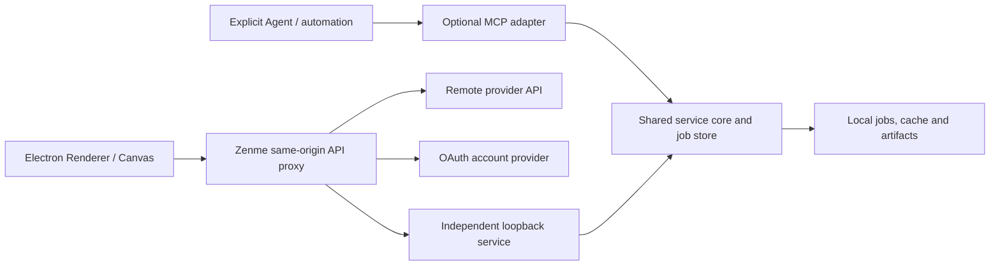

# Zenme Local 外部能力对接与产品规范

> 状态：已确认规范基线  
> 制定日期：2026-07-14  
> 适用产品：Zenme Local 及其独立本地组件  
> 相关文档：[PRD](prd.md)、[设计规范](design-standard.md)

## 1. 文档目的

本文统一规定 Zenme Local 如何发现、配置、调用和展示外部能力。这里的“外部能力”包括：

- 远程模型 API 服务商，例如 Zhipu、OpenRouter；
- 通过账号授权接入的服务商，例如 ChatGPT OAuth；
- 显式启用的 MCP 自动化适配；
- 用户自行安装的模型、运行时和分析器包。

本文同时是产品规范和技术合同。产品界面、画布节点、Next.js 代理、Electron 配置和独立服务均应遵循本文。单个能力可以有自己的补充接口文档，但不得与本文的安全、生命周期和交互规则冲突。

## 2. 核心原则

1. **Zenme 是工作台，不是所有能力的运行时。** 重模型、GPU 任务和独立领域服务应由独立组件负责。
2. **产品能力与实现阶段分离。** 用户选择“图片生成”，不直接选择某个内部 runner。
3. **传输方式服从能力生命周期。** 需要常驻或跨应用共享的服务可使用 loopback HTTP；适合随桌面会话按需启停的独立组件可使用 MCP stdio。
4. **渲染器不持有秘密，也不直连外部服务。** 所有调用经过 Zenme 同源服务端代理或 Electron 主进程。
5. **能力必须可发现、可协商、可降级。** 界面不得展示尚未安装、未启用或合同不兼容的操作。
6. **长任务必须持久化。** 任务可查询、取消、重试并在应用重启后恢复。
7. **结果节点拥有任务状态。** 上游资产节点和播放器节点不承载下游分析进度或错误。
8. **不把技术诊断冒充产品结果。** 内部阶段、模型原始异常和未经校准的分数默认不进入终端界面。
9. **成熟开源实现优先。** Zenme 和独立组件只编写必要的协议适配、任务编排和结果归一化层。
10. **本地优先不等于隐式联网。** 任何把用户内容发送到远程服务的能力必须在设置和操作处清楚标识。

## 3. 术语与对象模型

### 3.1 服务商 Provider

提供一个或多个可调用能力的配置实体。服务商保存连接方式、认证方式、协议适配器和模型列表，不代表全局默认选择。

### 3.2 能力 Capability

稳定、面向产品的最小能力标识，例如：

- `text.generate`
- `image.generate`
- `image.transform`

能力 ID 使用小写点分命名，发布后不得改变语义。服务内部的模型步骤、缓存阶段和 adapter ID 不属于公共能力。

### 3.3 操作 Operation

一次可由用户触发的产品动作。一个操作声明所需输入、可选参数、结果类型和是否为持久任务。操作可以映射到一个能力，也可以由服务端 Planner 展开多个内部依赖。

### 3.4 Profile

面向特定产品场景的能力组合。Profile 表达产品意图，不替代公共 capability，也不得泄露内部执行 DAG。

### 3.5 Job

持久长任务。Job 至少包含稳定 `jobId`、状态、进度、阶段摘要、权威起止时间、错误和结果引用。

### 3.6 Artifact

由能力生成、可独立读取或下载的大型产物，例如波形峰值、图片、音频代理、分轨、报告。Artifact 通过受控 ID 访问，不向渲染器返回本机绝对路径。

## 4. 接入形态与选择规则

| 形态 | 适用范围 | 默认传输 | 生命周期 | 示例 |
| --- | --- | --- | --- | --- |
| 应用内开源库 | 轻量、确定性、无独立 GPU 队列的通用能力 | 进程内调用 | Zenme | Markdown、文件解析、Tesseract OCR |
| 远程模型服务商 | 短请求或可流式返回的云端模型 | HTTPS，经同源代理 | 服务商 | Zhipu、OpenRouter |
| OAuth 账号服务商 | 需要浏览器授权和 Token 刷新的账号能力 | HTTPS，经同源代理 | 服务商 | ChatGPT |
| 独立本地服务 | 重模型、GPU、长任务、独立缓存或专用运行时 | MCP stdio 或 loopback HTTP | 独立组件/桌面会话 | 用户显式安装的组件 |
| MCP 适配 | 固定工作流、Agent 工具、自动化、调试或脚本集成 | stdio/显式连接 | 独立组件 | Agent 工具适配 |

选择规则：

1. 已有成熟库能够在现有 Node/Electron 运行时安全完成的轻量能力，优先直接集成。
2. 需要 Python/CUDA、长时间运行、独立队列、阶段缓存或崩溃隔离的能力，使用独立本地组件；传输根据是否需要常驻和跨应用共享选择 MCP stdio 或 loopback HTTP。
3. MCP 可作为已确认能力的固定 UI 工作流传输层，但长任务仍必须落入可靠的持久 Job Store，不能被伪装成单次同步工具调用。
4. Skill 只负责 Agent 侧知识和调用流程，不作为产品运行时依赖，也不能替代服务合同。
5. 不允许为了统一形式而把所有能力强行包装成 MCP，或把独立服务塞入 Electron/Next.js 进程。

## 5. 产品规范

### 5.1 设置页信息架构

设置页按能力类型分组：

- **模型配置**：文本、视觉输入、图片输出、向量、音频、排序和工具模型；
- **外部能力**：独立本地服务及其连接、运行状态、能力和缓存；
- **本地数据**：结果、artifact、缓存与备份策略；
- **Token 用量**：远程模型服务商明确返回的 usage 统计。

每个外部服务卡片至少显示：

- 名称、来源和本地/远程标识；
- 连接状态和协议版本；
- 已启用的公共能力数量；
- 服务版本及是否需要升级；
- 认证状态；
- “测试连接”“同步能力”“编辑”“断开”或“清理缓存”等适用操作。

不得使用“设为默认”作为服务商级产品操作。节点按最近一次同类能力选择恢复偏好；最近选择失效时进入未选择状态并提示用户确认，不能静默切换到另一服务商。

### 5.2 统一状态

界面只使用以下产品状态：

| 状态 | 含义 | 允许操作 |
| --- | --- | --- |
| `not-configured` | 尚未配置连接或授权 | 配置、登录 |
| `connecting` | 正在测试连接或授权 | 取消 |
| `available` | 合同兼容且所需能力可用 | 调用、同步、断开 |
| `degraded` | 基础连接正常，但部分能力缺失 | 调用可用能力、安装缺失项 |
| `upgrade-required` | 协议不兼容或客户端版本过低 | 查看升级说明 |
| `unavailable` | 连接失败、服务停止或认证失效 | 重试、编辑、重新登录 |

“已安装”只说明本地包存在，不等同于服务可用；“已连接”也不等同于用户所需 capability 已安装。

### 5.3 配置与保存

- 保存后设置面板保持打开并显示成功状态。
- 连接测试不得在保存前静默写入长期配置。
- URL、认证方式、API 格式和模型 ID 分开保存，不从显示别名推导真实模型 ID。
- 模型别名只影响界面，不参与路由和缓存身份。
- 模型模态由用户可见并可启用/禁用；“视觉”表示可读取图片，“图片”表示可输出或编辑图片，两者不可混用。
- 支持服务商主动拉取模型时，由用户手动执行同步，再决定添加和启用哪些模型。
- 不支持可靠模型枚举的服务商使用手动模型配置，不伪造全量列表。

### 5.4 画布操作与节点

1. 画布只展示当前已连接、已启用且输入兼容的操作。
2. 从上游节点拉线选择外部操作后，立即在松开位置创建结果节点，再启动任务。
3. 结果节点持有 `jobId`、状态和结果引用；父节点只提供输入身份，不显示子任务进度。
4. 一个操作创建一个结果节点。重试复用原节点及服务端缓存，不因重试创建重复节点。
5. 节点在排队和执行中显示运行时间；终态显示服务端权威总耗时。
6. 应用重启后按 `jobId` 恢复状态和结果，不把大型完整结果复制进画布快照。
7. 缺少能力时先创建的结果节点进入可理解的失败状态，允许用户前往设置安装或重新连接。
8. 上游输入变化后，旧结果保留但标记为“来源已变化”；未经用户确认不得静默覆盖。

### 5.5 同步、流式与长任务

- 文本生成等适合渐进展示的请求使用流式响应，但仍由 Zenme 服务端代理记录模型、耗时和 usage。
- 无法可靠在一次请求内完成、需要 GPU 队列或需要断线恢复的操作必须使用持久 Job。
- UI 不通过延长普通 HTTP 超时模拟任务系统。
- Job 使用 SSE 推送状态，同时保留轮询接口作为恢复和兼容路径。
- 取消是协作式操作；服务必须清理未完成临时文件，但不能删除此前成功缓存。

### 5.6 错误展示

用户界面只展示稳定错误码对应的可操作消息：

- 未配置或授权失效；
- 服务不可达；
- 协议版本不兼容；
- 必需能力未安装；
- 输入格式不支持；
- 任务超时、取消或资源不足；
- 服务商限流、配额不足或远程调用失败。

原始堆栈、模型路径、请求头、Token、第三方完整响应和本机绝对路径只能进入脱敏诊断日志，不得直接显示在节点中。

### 5.7 本地与远程标识

- 本地能力标记“本地处理”，不得暗示云端同步。
- 会上传用户文本、图片、音频或文档的操作标记“远程处理”。
- 用户第一次启用新的远程内容类型时，应说明发送的数据类别和服务商。
- 本地能力缺失时不得自动把内容发送到远程服务；远程降级必须由用户显式配置并确认。

## 6. 总体架构



边界要求：

- Renderer 只能调用 Zenme 同源 `/api/*`。
- Next.js Route Handler 只做鉴权、输入校验、协议映射和响应脱敏，不运行重型模型。
- Electron 主进程负责系统浏览器、OAuth 回调、受控文件能力和私有桌面配置。
- 独立服务负责自身运行时、模型、队列、任务数据库、缓存和 artifacts。

## 7. 通用能力描述

独立服务或服务商适配层应归一化为以下逻辑结构：

```json
{
  "serviceId": "example-local-service",
  "displayName": "示例本地能力",
  "serviceVersion": "0.1.0",
  "protocolVersion": 1,
  "locality": "local",
  "transport": "mcp-stdio",
  "capabilities": [
    {
      "id": "example.process",
      "version": 1,
      "enabled": true,
      "installed": true,
      "experimental": false,
      "inputKinds": ["file"],
      "outputKinds": ["document"],
      "execution": "job"
    }
  ]
}
```

规则：

- `serviceId + capability.id + capability.version` 构成公共能力身份。
- `enabled` 表示用户允许使用；`installed` 表示运行时具备实现，两者必须分别报告。
- 实验能力必须显式标记，不能混入稳定结果字段。
- 新增字段采用 additive 方式，旧客户端可忽略。
- 内部 adapter、模型路径和阶段图只放入受控诊断数据。

## 8. 独立本地服务合同

### 8.1 基础端点

独立服务默认提供：

```text
GET  /v1/health
GET  /v1/capabilities
POST /v1/jobs/plan       # 可选只读预检
POST /v1/jobs
GET  /v1/jobs/{jobId}
GET  /v1/jobs/{jobId}/events
POST /v1/jobs/{jobId}/cancel
POST /v1/jobs/{jobId}/retry
GET  /v1/jobs/{jobId}/result
```

需要模型安装、缓存管理或 artifact 下载时再增加版本化管理端点。管理端点同样需要认证和 loopback 限制。

### 8.2 Health

Health 至少返回：

- `status`；
- `serviceVersion` 或 `version`；
- `protocolVersion`；
- 运行时与设备摘要；
- 磁盘或关键资源不足状态。

Health 不返回 Token、本机用户目录、模型绝对路径或用户输入。

### 8.3 Capabilities

Capabilities 至少区分：

- 公共能力或产品 profile；
- 已安装适配器；
- 缺失模型包；
- 实验能力；
- 许可证和设备要求；
- 降级状态。

Zenme 先协商能力再展示操作。旧服务缺少新字段时使用显式兼容映射，不猜测内部能力。

### 8.4 Job 请求

```json
{
  "projectId": "project-id",
  "inputRef": {
    "kind": "local-file",
    "fileId": "file-id",
    "sha256": "content-sha256"
  },
  "profile": "comprehensive-analysis",
  "capabilities": ["key", "rhythm"],
  "options": {
    "requiredCapabilities": ["key"]
  }
}
```

当前服务仍需要 `inputPath` 时，路径只由 Zenme 服务端在受控文件 ID 校验后解析并发送，Renderer 不得自行提交任意路径。

### 8.5 Job 状态

统一状态为：

```text
queued → preparing → running → succeeded
                           ├→ failed
                           └→ cancelled
```

快照至少包含：

- `jobId`；
- `status`、`progress`、`currentStage`；
- `createdAt`、`startedAt`、`completedAt`；
- 执行中 `elapsedMs` 和终态 `durationMs`；
- `retryable`；
- 脱敏错误；
- 可选 `plannedStages`、`completedStages`。

服务端时间是权威来源。前端只能在状态更新间隔内补帧，不能覆盖最终耗时。

### 8.6 SSE

- 使用标准 `text/event-stream`。
- 事件至少包含状态、进度、阶段和终态。
- 每个事件包含递增 ID，客户端可使用 `Last-Event-ID` 恢复。
- SSE 断开不代表任务取消；客户端回退到 Job 查询。
- 事件不得包含完整用户内容或模型原始日志。

### 8.7 Result 与 Artifact

- 小型结构化结果通过 `/result` 返回。
- 大型文件通过 artifact ID 单独读取。
- 音视频 artifact 支持 HTTP Range、正确 MIME、长度和 `206 Partial Content`。
- 结果字段包含来源、模型/分析器版本及置信度状态。
- 冲突候选保留在诊断数据，产品字段只给出归一化最终结果。
- Artifact 删除、缓存清理和项目原文件删除是不同操作，不能互相隐式触发。

## 9. 远程模型服务商合同

### 9.1 路由

- 根据真实模型 ID 定位所属服务商和协议适配器。
- 文本、视觉输入和图片输出分别校验模态。
- 服务商协议由明确 adapter 分派，不使用“所有服务商都当 OpenAI 兼容”作为默认假设。
- 模型别名不参与路由。

### 9.2 模型同步

- 支持可靠枚举接口的服务商提供手动“拉取模型”。
- 同步只更新候选，不自动启用所有新模型，也不覆盖用户别名和模态选择。
- 已移除模型标记为不可用，不立即删除节点中保存的历史模型信息。
- 不支持全量拉取的服务商使用手工添加和显式模型 ID。

### 9.3 OAuth

- 使用系统浏览器和 PKCE。
- 回调仅监听临时 loopback 地址，并校验 state、PKCE verifier 和回调时限。
- access token、refresh token 只存在于私有本地令牌文件或系统凭据存储。
- Renderer、普通设置 JSON、日志、备份和错误响应不包含 OAuth Token。
- 退出登录立即删除令牌并使账号模型不可调用，但保留历史节点的显示名称。

## 10. MCP 规范

- MCP 是否默认启用由具体能力的产品决策确定。
- MCP adapter 复用现有服务核心、Job Store、缓存和 schema，不复制业务逻辑。
- 同一操作只选择一种传输；显式 HTTP 覆盖失败时不得自动切换到 MCP 并重复创建任务。
- MCP 工具返回持久 `jobId` 或稳定资源 URI，不把长任务伪装成单次同步工具调用。
- MCP 的工具名称不是 Zenme 公共 capability ID；需要经过适配映射。
- 允许由首次产品请求按需创建已配置的 MCP 子进程；后续请求复用同一会话，并在 Zenme 本地服务退出或重启时清理。

## 11. 安全与隐私

### 11.1 调用边界

- Zenme 本地 API 只接受 loopback、同源请求，拒绝跨站调用。
- 使用 HTTP 的独立本地服务只监听 loopback 并使用高熵 Bearer Token；MCP stdio 模式不得额外监听网络端口。
- 远程服务 URL 仅允许 HTTP/HTTPS，禁止嵌入凭据、查询串和片段。
- 通用远程代理必须防止 SSRF；本地服务代理只允许已配置的 loopback 地址和固定 `/v1/*` 路径。

### 11.2 秘密

- API Key、服务 Token 和 OAuth Token 不进入 Renderer 状态。
- 设置接口只返回“已配置”或掩码，不回显完整秘密。
- 本地备份默认移除全部秘密。
- 日志和错误必须统一脱敏 Authorization、Cookie、Token、API Key 和代理凭据。

### 11.3 文件与内容

- 用户输入形成的路径必须通过限定根目录解析。
- 对独立服务优先传递文件 ID 与哈希；兼容绝对路径时也必须落在 allowlist。
- 远程调用只发送完成操作所需的最小内容。
- 缓存和 artifact 保存在用户本地数据目录，遵循项目删除和独立缓存清理规则。

## 12. 缓存、幂等与恢复

- 缓存身份至少包含输入内容哈希、能力/adapter 版本、模型指纹和相关参数。
- 不相关的产品能力不能污染阶段缓存键。
- 同一请求可以获得独立 `jobId`，但可复用已有阶段结果。
- 服务重启后恢复未完成 Job，或将无法恢复的 Job 明确标记为可重试失败。
- 客户端重试必须携带稳定请求身份或调用 `/retry`，避免重复产生昂贵结果。
- 模板、展示和报告版本变化不能导致音频、图片等上游重模型无条件重跑。

## 13. 版本与兼容

- API 路径使用主版本 `/v1/`。
- Health 返回 `protocolVersion`，Capabilities 可返回 `minimumClientVersion`。
- 同一主版本只做 additive schema 演进；删除或改变语义需要新主版本。
- 客户端按 capability 协商，不按服务版本字符串硬编码功能。
- 旧字段迁移应保留读取兼容，并在写回时升级到新 schema。
- 不兼容时显示“需要升级”，不得继续提交可能产生错误结果的任务。

## 14. 用量与诊断

- 远程模型 Token 只采用服务商明确返回的 usage，不自行估算。
- 本地独立任务记录调用次数、阶段耗时、缓存命中和资源错误，不计入远程 Token。
- 普通诊断不保存提示词、歌词、图片内容、音频或完整模型响应。
- 开发诊断可以通过显式开关读取脱敏阶段摘要，默认关闭。
- 用户清理连接配置不会删除独立服务中的结果；清理缓存必须是单独确认操作。

## 15. 许可证与安装

- 引入开源库、模型或运行时前核对许可证、维护状态、包体积、安全记录和桌面兼容性。
- 模型安装前显示下载大小、磁盘需求、设备要求、代码许可证和权重许可证。
- 许可证不明确、非商业或限制再分发的模型不得静默进入发行包。
- 用户自备模型必须标记来源和实验状态；Zenme 不为其正确性和再分发权背书。
- 安装失败可继续，不影响 Zenme 其他功能；能力状态进入 `degraded`。

## 16. 接入验收清单

新外部能力只有满足以下条件才可进入稳定产品入口：

### 产品

- [ ] 明确输入、结果节点、重试和取消行为。
- [ ] 设置页能区分未配置、可用、降级和不可用。
- [ ] 本地/远程处理标识清楚。
- [ ] 不存在服务商级“默认模型”按钮或静默跨服务商回退。
- [ ] 错误消息可操作且不暴露技术秘密。

### 合同

- [ ] Health、Capabilities 和版本协商通过。
- [ ] 长任务支持 Job 查询、SSE 或轮询、取消、重试和恢复。
- [ ] Result 与 artifact schema 有测试和示例。
- [ ] 新旧版本兼容策略已验证。
- [ ] 缺失必需能力可以在重任务前快速失败。

### 安全

- [ ] Renderer 无法读取完整 Token 或 API Key。
- [ ] loopback、同源、SSRF 和路径 allowlist 测试通过。
- [ ] 日志、错误和备份不含秘密与用户内容。
- [ ] 模型及开源依赖许可证完成复审。

### 质量

- [ ] 有真实输入端到端测试，不只验证 mock。
- [ ] 服务停止、重启、断网、取消和超时均有回归测试。
- [ ] 缓存命中不会重复运行重模型。
- [ ] Zenme 关闭后独立服务的既有任务行为符合生命周期声明。

## 17. 当前实现需统一的事项

以下是规范落地时需要处理的已知偏差：

1. `ModelProviderConfig.isDefault` 与 `modelMapping` 属于历史兼容字段，UI 不应暴露“设为默认”；后续通过版本化设置迁移移除产品语义。
2. 外部能力设置可复用统一状态组件，但不得为追求统一而合并不同协议的业务表单。

## 18. 待确认问题

- 是否允许同一外部能力类型同时保存多个独立本地服务实例；当前建议首版只激活一个连接。
- 是否提供由 Zenme 管理安装但仍独立运行的 sidecar 模式；在确认升级、退出和数据归属前不实现。
- 外部能力是否需要统一导入/导出非敏感配置；即使支持，秘密仍必须排除。
